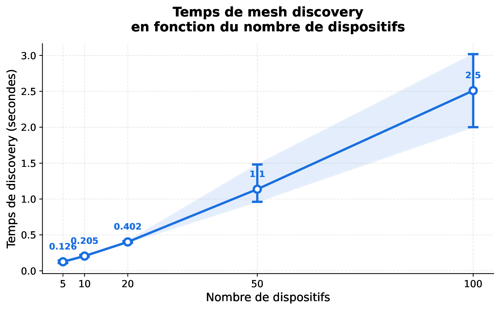
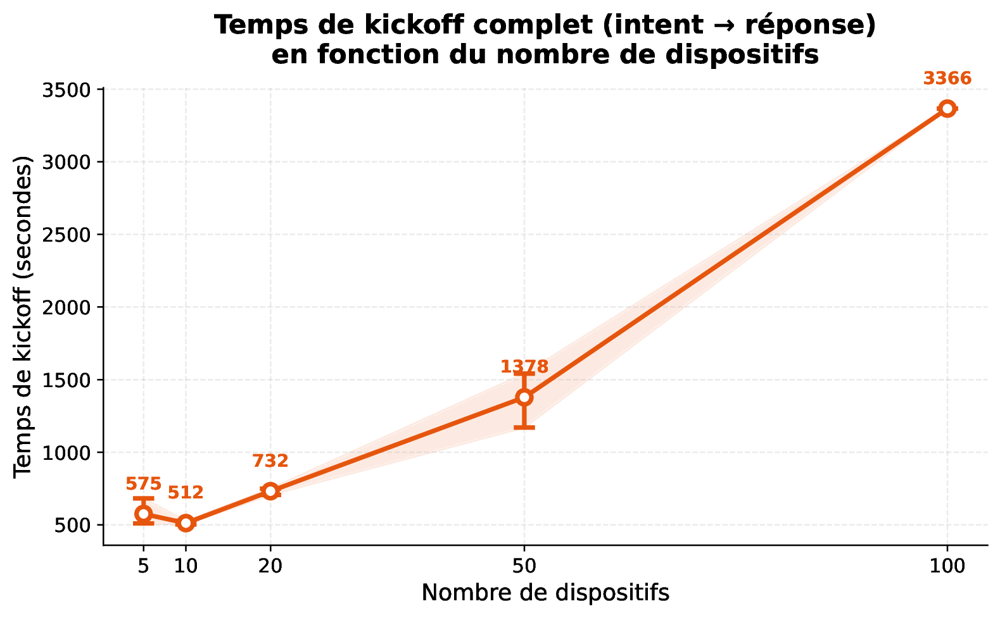
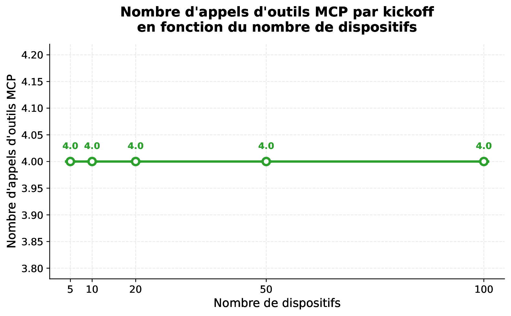
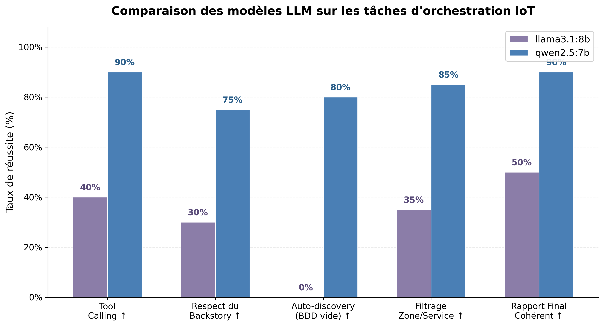

<h1 align="center">LLMThings</h1>

<p align="center">
  <b>LLM-driven orchestration of large-scale IoT deployments.</b><br>
  A multi-agent system that discovers, orchestrates and supervises a heterogeneous
  IoT infrastructure from a single natural-language intent — validated on real ESP32 hardware.
</p>

<p align="center">
  
  
  
  
  
  
</p>

---

A user states a high-level goal — *"Make sure the patient does not fall, wherever she goes."* —
and the system autonomously **discovers** the available devices, **reasons** about the intent
and the live deployment state, and **acts** by waking exactly the sensors it needs and putting
the rest back to sleep. The LLM never runs arbitrary code: every action goes through a fixed
catalogue of **MCP tools**, keeping execution bounded and auditable.

## Features

-  **Two collaborating LLM agents** (Monitoring + Orchestration) built on CrewAI, talking to
  each other in natural language and answering in canonical JSON.
-  **MCP abstraction layer** — 8 standardized tools decouple agent reasoning from device IPs,
  protocols and payloads.
-  **Zero-config mesh discovery** — a BFS over the neighbor graph finds the whole deployment
  from a single seed device; the Monitoring Agent even triggers it on its own when the DB is empty.
-  **Privilege separation** — only the Monitoring Agent can write to the registry; the
  Orchestration Agent is limited to action commands.
- ⚡ **Energy-aware orchestration** — sensors default to light sleep and are woken progressively,
  on demand.
-  **One-command stack** — broker, MCP server, local LLM and agents all run via Docker Compose.
-  **Validated on real ESP32s** end-to-end, plus a 6-script incremental test suite.

## Architecture

```
┌─────────────────────────────────────────────────────────────┐
│ LAYER 1 — User intent                                        │
│   Natural-language request ("make sure she doesn't fall…")   │
├─────────────────────────────────────────────────────────────┤
│ LAYER 2 — Decision (LLM agents, CrewAI)                      │
│   Monitoring Agent  ⇄  Orchestration Agent                   │
│   (talk in natural language, answer in JSON)                 │
├─────────────────────────────────────────────────────────────┤
│ LAYER 3 — Abstraction (MCP server, FastMCP)                  │
│   8 standardized tools  +  SQLite device registry            │
├─────────────────────────────────────────────────────────────┤
│ LAYER 4 — IoT execution (ESP32)                              │
│   Badge · ultrasonic sensor · camera — HTTP + MQTT (Mosquitto)│
└─────────────────────────────────────────────────────────────┘
```

### The two agents

| Agent | Responsibility | Tools | DB writes |
|-------|----------------|-------|:---:|
| **Monitoring Agent** | Discovers the infrastructure and maintains the device registry — the single source of truth. | the 5 `monitoring_*` tools |  only writer |
| **Orchestration Agent** | Interprets the intent and turns it into concrete device actions. | the 3 `orchestration_*` tools + CrewAI delegation | not at all |

The Orchestration Agent has `allow_delegation=True`, so CrewAI lets it ask the Monitoring Agent
free-form questions (e.g. *"Which active devices in the corridor expose a camera service?"*).
The Monitoring Agent replies with canonical JSON. The whole dialogue is visible in the verbose
logs — handy for live demos.

### MCP tools

| Tool | Category | Role |
|------|----------|------|
| `monitoring_discover_network` | Monitoring | BFS-traverse the neighbor graph from a seed |
| `monitoring_get_capabilities` | Monitoring | Query a device's `/capabilities` |
| `monitoring_get_health` | Monitoring | Query a device's `/health` |
| `monitoring_read_devices` | Monitoring | Read the DB with filters (zone, service, status) |
| `monitoring_write_device` | Monitoring | Insert/update a device in the DB |
| `orchestration_wake_up_device` | Orchestration | Wake a device via `POST /wake` |
| `orchestration_put_device_to_sleep` | Orchestration | Sleep a device via `POST /sleep` |
| `orchestration_activate_service` | Orchestration | Activate a service on a device |

### Mesh discovery

Each device declares its neighbors in `/capabilities`. The MCP server contacts a **seed** device,
reads its capabilities, registers it and enqueues its neighbors, then repeats a **breadth-first
traversal** until every reachable node is stored. Adding a device only requires declaring it as a
neighbor of an existing one — no change to the server or the agents. An unreachable device is
marked `failed` and skipped.

## Tech stack

| Layer | Technology |
|-------|------------|
| Agents | CrewAI · Ollama · `qwen2.5:7b` |
| Abstraction | FastMCP (`stateless_http`) · SQLAlchemy · SQLite |
| Messaging | MQTT (Eclipse Mosquitto) · HTTP/REST |
| Firmware | ESP32 (Arduino) · FreeRTOS |
| Tooling | Docker Compose · Python 3.11 |

## Hardware

| Device | Board | Sensors | Default state |
|--------|-------|---------|---------------|
| `badge-001` | ESP32-S3 | MPU6050 (IMU) + microphone | always active (MQTT push) |
| `esp32-fixe-001` | ESP32 + HC-SR04 | ultrasonic passage detection | light sleep (HTTP on demand) |
| `esp32-cam-001` | ESP32-CAM | OV2640 camera | light sleep (HTTP on demand) |

Every device, regardless of type, exposes the same HTTP contract so the MCP layer can treat them
uniformly:

| Endpoint | Method | Role |
|----------|--------|------|
| `/capabilities` | GET | Canonical device JSON (id, IP, zone, services, neighbors) |
| `/health` | GET | Current state (status, battery, RSSI) |
| `/wake` | POST | Switch to active mode |
| `/sleep` | POST | Switch to light sleep |
| `/activate_service` | POST | Activate a specific service |

<details>
<summary>Example <code>/capabilities</code> response</summary>

```json
{
  "device_id": "badge-001",
  "ip": "192.168.193.24",
  "status": "active",
  "device_type": "badge",
  "location": { "zone": "on_patient", "x": 0.0, "y": 0.0, "z": 1.1 },
  "services": [
    { "name": "imu",   "protocol": "MQTT", "details": { "fall_detection": true } },
    { "name": "sound", "protocol": "MQTT", "details": {} }
  ],
  "neighbors": [
    { "device_id": "esp32-cam-001",  "ip": "192.168.193.77" },
    { "device_id": "esp32-fixe-001", "ip": "192.168.193.1" }
  ]
}
```
</details>

## Getting started

### Docker (recommended)

```bash
# Point the seed at one of your devices (real or fake)
export SEED_DEVICE_IP=192.168.1.50:80

# Bring up mqtt + mcp_server + ollama + crew (first boot pulls qwen2.5:7b, ~5 GB)
docker compose --profile dockered-ollama up -d --build

# Run a full end-to-end kickoff inside the crew container
docker compose --profile dockered-ollama run --rm crew python -m scripts.test_crew_e2e
```

| Service | Role |
|---------|------|
| `mqtt` | Mosquitto broker (port 1883) |
| `mcp_server` | FastMCP server (port 8765) + SQLite registry |
| `ollama` | Local LLM server hosting `qwen2.5:7b` |
| `ollama_init` | One-shot model pull on first boot |
| `crew` | CrewAI agents + test/benchmark scripts |

### Local (development)

```bash
pip install sqlalchemy httpx fastapi uvicorn
pip install -r mcp_server/requirements.txt
pip install -r crew/requirements.txt

# Lower layers (no LLM needed)
python -m scripts.test_local
python -m scripts.test_e2e_combined
python -m scripts.test_crew_connection

# Full stack (needs Ollama)
ollama serve &
ollama pull qwen2.5:7b
python -m scripts.test_crew_e2e
```

## Usage

Drive the system with a single natural-language intent:

```python
from crew.crew import build_crew

crew = build_crew()
result = crew.kickoff(inputs={
    "intent": "Make sure the patient does not fall, wherever she goes."
})
print(result)
```

Starting from an **empty database**, the agents discover the infrastructure and act entirely on
their own:

```text
[Monitoring] tool: monitoring_read_devices()       -> count: 0
[Monitoring] tool: monitoring_discover_network()   -> 3 devices
[Monitoring] tool: monitoring_read_devices()       -> count: 3
   badge-001       zone=on_patient  services=[imu, sound]
   esp32-cam-001   zone=corridor    services=[camera]
   esp32-fixe-001  zone=corridor    services=[ultrasonic]
[Orchestration] wake_up esp32-fixe-001 -> activate_service ultrasonic -> sleep unused
```

The empty-DB → discover → resume behavior is **not** hard-coded; it emerges from the LLM's
reasoning guided by its backstory.

## Testing

Six incremental scripts validate the system from "no dependencies" up to "full stack with the
LLMs". Run them bottom-up.

| Script | Validates |
|--------|-----------|
| `test_local` | Database CRUD + canonical JSON shape |
| `test_e2e_combined` | Discovery + MCP tools against 4 fake ESP32s |
| `test_crew_connection` | CrewAI ⇄ MCP wiring and tool discovery |
| `test_crew_e2e` | Full kickoff: 2 LLMs + 4 fake ESP32s |
| `test_crew_real_badge` | Kickoff against the real physical badge |
| `test_crew_mesh_autodiscover` | Kickoff on an empty DB — agent triggers discovery |

## Benchmarks

Simulated deployments of 5–100 devices (fake ESP32s, chain topology with cross-links), 3 runs
each, `qwen2.5:7b` on CPU.

**Mesh discovery scales linearly** — ~0.12 s at 5 devices, ~2.5 s at 100 (BFS, *O(V + E)*), with
zero connection failures.



**Kickoff time is dominated by LLM inference**, not the IoT layer — the JSON context handed
between agents grows with the deployment. A GPU or a lighter model would cut these times sharply.



**Tool calls stay constant at 4 per kickoff** regardless of deployment size: the agents rely on
zone/service filtering instead of scanning devices one by one, so interactions depend only on the
intent's complexity.



**Model choice matters.** `qwen2.5:7b` clearly outperformed `llama3.1:8b` on tool calling and was
the only one able to trigger autonomous discovery on an empty DB (80% vs 0%), so it was kept as
the reference model.



## Project structure

```
llmthings_v2/
├── docker-compose.yml          # mqtt + mcp_server + ollama + crew
├── mosquitto/                  # broker config
├── database/                   # SQLAlchemy models + CRUD + canonical JSON
├── mcp_server/                 # FastMCP server + ESP32 HTTP client + tools/
├── crew/                       # CrewAI agents, tasks, crew wiring
├── firmware/                   # ESP32 firmware (badge, ultrasonic, camera)
├── scripts/                    # tests + scalability benchmarks
├── assets/                     # benchmark charts
└── data/                       # SQLite DBs + benchmark CSV
```

## Authors

**Nadir Madi · Insaf Benali · Céline Maoudji** — supervised by M. Massinissa Hamidi (IBISC).
M1 Computer & Network Systems · *Systèmes Autonomiques* · Université d'Évry Paris-Saclay · 2025/2026.
